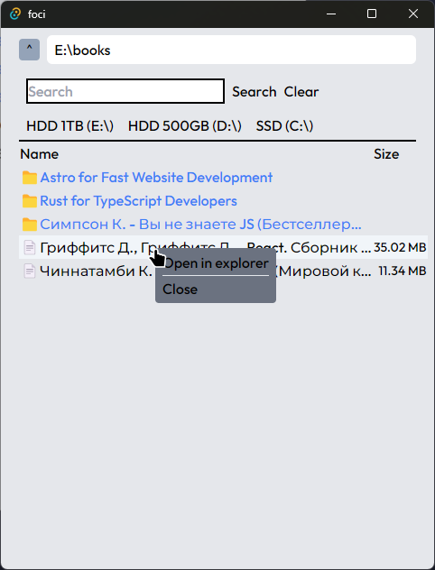

# File Manager 
Simple file manager made with Rust backend and React frontend

    

## Made with
- [Rust](https://www.rust-lang.org/)
- [Tauri](https://tauri.app/)
- [React](https://reactjs.org/)

## Features
- You can view files and traverse directories
- Searching files very quickly with Rust
- Context menu on files

## TODO:
- [x] add file viewing
- [x] add file searching
- [ ] add file creation, deletion, renaming

- [ ] favorite folders (Desktop, Documents, Downloads etc.)
- [ ] folder management system (drag and drop files, changed files)
- [ ] diffs between folders
- [ ] vim-like command line